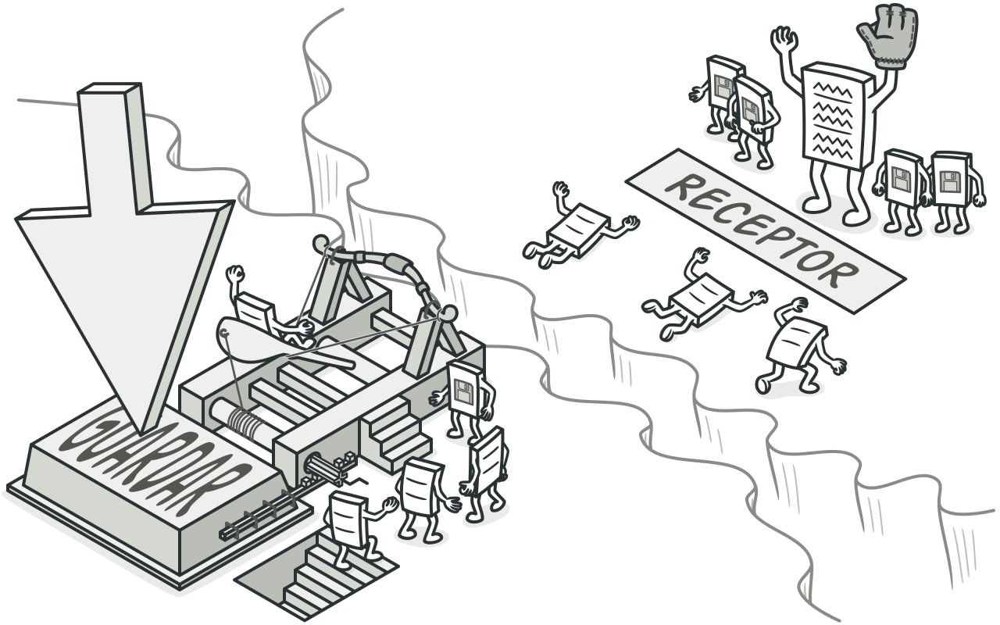
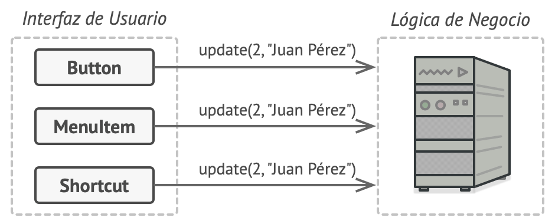
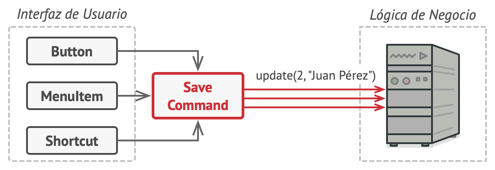
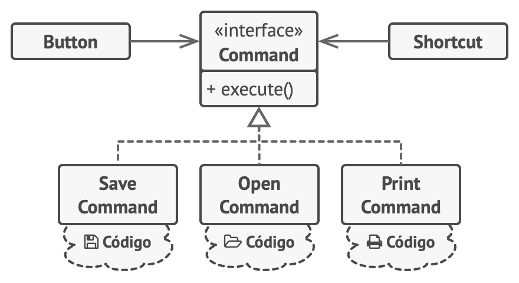
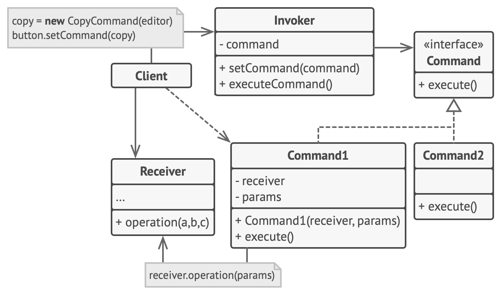

# Command (Comando, Orden, Action, Transaction)

## Propósito

**Command** es un patrón de diseño de comportamiento que convierte una solicitud en un objeto independiente que contiene toda la información sobre la solicitud. Esta transformación te permite parametrizar los métodos con diferentes solicitudes, retrasar o poner en cola la ejecución de una solicitud y soportar operaciones que no se pueden realizar.

## Problema

Imagina que estás trabajando en una nueva aplicación de edición de texto. Tu tarea actual consiste en crear una barra de herramientas con unos cuantos botones para varias operaciones del editor. Creaste una clase Botón muy limpia que puede utilizarse para los botones de la barra de herramientas y también para botones genéricos en diversos diálogos.

*Todos los botones de la aplicación provienen de la misma clase.*

Aunque todos estos botones se parecen, se supone que hacen cosas diferentes. ¿Dónde pondrías el código para los varios gestores de clics de estos botones? La solución más simple consiste en crear cientos de subclases para cada lugar donde se utilice el botón. Estas subclases contendrán el código que deberá ejecutarse con el clic en un botón.

*Muchas subclases de botón. ¿Qué puede salir mal?*

Pronto te das cuenta de que esta solución es muy deficiente. En primer lugar, tienes una enorme cantidad de subclases, lo cual no supondría un problema si no corrieras el riesgo de descomponer el código de esas subclases cada vez que modifiques la clase base Botón. Dicho de forma sencilla, tu código GUI depende torpemente del volátil código de la lógica de negocio.

*Varias clases implementan la misma funcionalidad.*

Y aquí está la parte más desagradable. Algunas operaciones, como copiar/pegar texto, deben ser invocadas desde varios lugares. Por ejemplo, un usuario podría hacer clic en un pequeño botón “Copiar” de la barra de herramientas, o copiar algo a través del menú contextual, o pulsar `Ctrl+C` en el teclado.

Inicialmente, cuando tu aplicación solo tenía la barra de herramientas, no había problema en colocar la implementación de varias operaciones dentro de las subclases de botón. En otras palabras, tener el código para copiar texto dentro de la subclase `BotónCopiar` estaba bien. Sin embargo, cuando implementas menús contextuales, atajos y otros elementos, debes duplicar el código de la operación en muchas clases, o bien hacer menús dependientes de los botones, lo cual es una opción aún peor.

## Solución

El buen diseño de software a menudo se basa en el principio de separación de responsabilidades, lo que suele tener como resultado la división de la aplicación en capas. El ejemplo más habitual es tener una capa para la interfaz gráfica de usuario (GUI) y otra capa para la lógica de negocio. La capa GUI es responsable de representar una bonita imagen en pantalla, capturar entradas y mostrar resultados de lo que el usuario y la aplicación están haciendo. Sin embargo, cuando se trata de hacer algo importante, como calcular la trayectoria de la luna o componer un informe anual, la capa GUI delega el trabajo a la capa subyacente de la lógica de negocio.

El código puede tener este aspecto: un objeto GUI invoca a un método de un objeto de la lógica de negocio, pasándole algunos argumentos. Este proceso se describe habitualmente como un objeto que envía a otro una solicitud.

*Los objetos GUI pueden acceder directamente a los objetos de la lógica de negocio.*

El patrón Command sugiere que los objetos GUI no envíen estas solicitudes directamente. En lugar de ello, debes extraer todos los detalles de la solicitud, como el objeto que está siendo invocado, el nombre del método y la lista de argumentos, y ponerlos dentro de una clase comando separada con un único método que activa esta solicitud.

Los objetos de comando sirven como vínculo entre varios objetos GUI y de lógica de negocio. De ahora en adelante, el objeto GUI no tiene que conocer qué objeto de la lógica de negocio recibirá la solicitud y cómo la procesará. El objeto GUI activa el comando, que gestiona todos los detalles.

*Acceso a la capa de lógica de negocio a través de un comando.*

El siguiente paso es hacer que tus comandos implementen la misma interfaz. Normalmente tiene un único método de ejecución que no acepta parámetros. Esta interfaz te permite utilizar varios comandos con el mismo emisor de la solicitud, sin acoplarla a clases concretas de comandos. Adicionalmente, ahora puedes cambiar objetos de comando vinculados al emisor, cambiando efectivamente el comportamiento del emisor durante el tiempo de ejecución.

Puede que hayas observado que falta una pieza del rompecabezas, que son los parámetros de la solicitud. Un objeto GUI puede haber proporcionado al objeto de la capa de negocio algunos parámetros. Ya que el método de ejecución del comando no tiene parámetros, ¿cómo pasaremos los detalles de la solicitud al receptor? Resulta que el comando debe estar preconfigurado con esta información o ser capaz de conseguirla por su cuenta.

*Los objetos GUI delegan el trabajo a los comandos.*

Regresemos a nuestro editor de textos. Tras aplicar el patrón Command, ya no necesitamos todas esas subclases de botón para implementar varios comportamientos de clic. Basta con colocar un único campo dentro de la clase base `Botón` que almacene una referencia a un objeto de comando y haga que el botón ejecute ese comando en un clic.

Implementarás un puñado de clases de comando para toda operación posible y las vincularás con botones particulares, dependiendo del comportamiento pretendido de los botones.

Otros elementos GUI, como menús, atajos o diálogos enteros, se pueden implementar del mismo modo. Se vincularán a un comando que se ejecuta cuando un usuario interactúa con el elemento GUI. Como probablemente ya habrás adivinado, los elementos relacionados con las mismas operaciones se vincularán a los mismos comandos, evitando cualquier duplicación de código.

Como resultado, los comandos se convierten en una conveniente capa intermedia que reduce el acoplamiento entre las capas de la GUI y la lógica de negocio. ¡Y esto es tan solo una fracción de las ventajas que ofrece el patrón Command!

## Analogía en el mundo real

*Realizando un pedido en un restaurante.*

Tras un largo paseo por la ciudad, entras en un buen restaurante y te sientas a una mesa junto a la ventana. Un amable camarero se acerca y toma tu pedido rápidamente, apuntándolo en un papel. El camarero se va a la cocina y pega el pedido a la pared. Al cabo de un rato, el pedido llega al chef, que lo lee y prepara la comida. El cocinero coloca la comida en una bandeja junto al pedido. El camarero descubre la bandeja, comprueba el pedido para asegurarse de que todo está como lo querías, y lo lleva todo a tu mesa.

El pedido en papel hace la función de un comando. Permanece en una cola hasta que el chef está listo para servirlo. Este pedido contiene toda la información relevante necesaria para preparar la comida. Permite al chef empezar a cocinar de inmediato, en lugar de tener que correr de un lado a otro aclarando los detalles del pedido directamente contigo.

## Estructura

1. La clase **Emisora** (o invocadora) es responsable de inicializar las solicitudes. Esta clase debe tener un campo para almacenar una referencia a un objeto de comando. El emisor activa este comando en lugar de enviar la solicitud directamente al receptor. Ten en cuenta que el emisor no es responsable de crear el objeto de comando. Normalmente, obtiene un comando precreado de parte del cliente a través del constructor.

2. La interfaz *Comando* normalmente declara un único método para ejecutar el comando.

3. Los **Comandos Concretos** implementan varios tipos de solicitudes. Un comando concreto no se supone que tenga que realizar el trabajo por su cuenta, sino pasar la llamada a uno de los objetos de la lógica de negocio. Sin embargo, para lograr simplificar el código, estas clases se pueden fusionar.

  Los parámetros necesarios para ejecutar un método en un objeto receptor pueden declararse como campos en el comando concreto. Puedes hacer inmutables los objetos de comando permitiendo la inicialización de estos campos únicamente a través del constructor.

4. La clase **Receptora** contiene cierta lógica de negocio. Casi cualquier objeto puede actuar como receptor. La mayoría de los comandos solo gestiona los detalles sobre cómo se pasa una solicitud al receptor, mientras que el propio receptor hace el trabajo real.

5. El **Cliente** crea y configura los objetos de comando concretos. El cliente debe pasar todos los parámetros de la solicitud, incluyendo una instancia del receptor, dentro del constructor del comando. Después de eso, el comando resultante puede asociarse con uno o varios emisores.

## Aplicabilidad

* **Utiliza el patrón Command cuando quieras parametrizar objetos con operaciones.**

  El patrón Command puede convertir una llamada a un método específico en un objeto autónomo. Este cambio abre la puerta a muchos usos interesantes: puedes pasar comandos como argumentos de método, almacenarlos dentro de otros objetos, cambiar comandos vinculados durante el tiempo de ejecución, etc.

  Aquí tienes un ejemplo: estás desarrollando un componente GUI, como un menú contextual, y quieres que los usuarios puedan configurar opciones del menú que activen operaciones cuando un usuario final haga clic sobre ellos.

* **Utiliza el patrón Command cuando quieras poner operaciones en cola, programar su ejecución, o ejecutarlas de forma remota.**

  Como pasa con cualquier otro objeto, un comando se pueden serializar, lo cual implica convertirlo en una cadena que pueda escribirse fácilmente a un archivo o una base de datos. Más tarde, la cadena puede restaurarse como el objeto de comando inicial. De este modo, puedes retardar y programar la ejecución del comando. ¡Pero aún hay más! Del mismo modo, puedes poner comandos en cola, así como registrarlos o enviarlos por la red.

* **Utiliza el patrón Command cuando quieras implementar operaciones reversibles.**

  Aunque hay muchas formas de implementar deshacer/rehacer, el patrón Command es quizá la más popular de todas.

  Para poder revertir operaciones, debes implementar el historial de las operaciones realizadas. El historial de comando es una pila que contiene todos los objetos de comando ejecutados junto a copias de seguridad relacionadas del estado de la aplicación.

  Este método tiene dos desventajas. Primero, no es tan fácil guardar el estado de una aplicación, porque parte de ella puede ser privada. Este problema puede mitigarse con el patrón Memento.

  Segundo, las copias de seguridad de estado pueden consumir mucha memoria RAM. Por lo tanto, en ocasiones puedes recurrir a una implementación alternativa: en lugar de restaurar el estado pasado, el comando realiza la operación inversa, aunque ésta también tiene un precio, ya que puede resultar difícil o incluso imposible de implementar.

## Cómo implementarlo

1. Declara la interfaz de comando con un único método de ejecución.

2. Empieza extrayendo solicitudes y poniéndolas dentro de clases concretas de comando que implementen la interfaz de comando. Cada clase debe contar con un grupo de campos para almacenar los argumentos de las solicitudes junto con referencias al objeto receptor. Todos estos valores deben inicializarse a través del constructor del comando.

3. Identifica clases que actúen como emisoras. Añade los campos para almacenar comandos dentro de estas clases. Las emisoras deberán comunicarse con sus comandos tan solo a través de la interfaz de comando. Normalmente las emisoras no crean objetos de comando por su cuenta, sino que los obtienen del código cliente.

4. Cambia las emisoras de forma que ejecuten el comando en lugar de enviar directamente una solicitud al receptor.

5. El cliente debe inicializar objetos en el siguiente orden:

  * Crear receptores.
  * Crear comandos y asociarlos con receptores si es necesario.
  * Crear emisores y asociarlos con comandos específicos.

## Pros y contras

:heavy_check_mark: Principio de responsabilidad única. Puedes desacoplar las clases que invocan operaciones de las que realizan esas operaciones.

:heavy_check_mark: Principio de abierto/cerrado. Puedes introducir nuevos comandos en la aplicación sin descomponer el código cliente existente.

:heavy_check_mark: Puedes implementar deshacer/rehacer.

:heavy_check_mark: Puedes implementar la ejecución diferida de operaciones.

:heavy_check_mark: Puedes ensamblar un grupo de comandos simples para crear uno complejo.

:x: El código puede complicarse, ya que estás introduciendo una nueva capa entre emisores y receptores.
