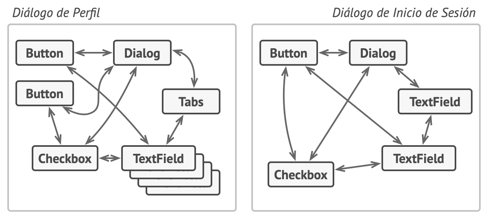
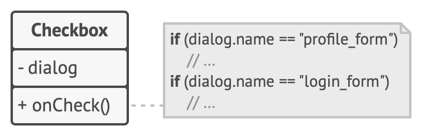
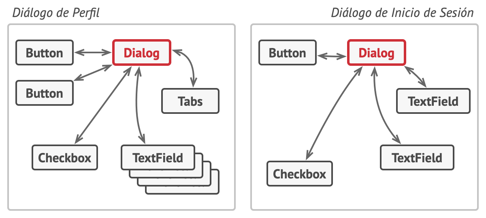
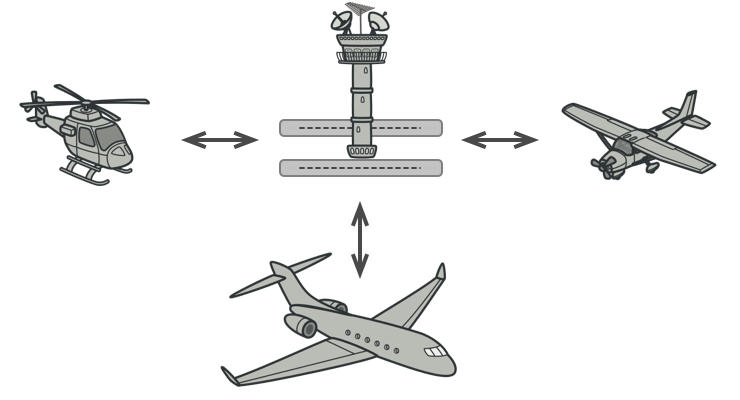

# Mediator (Mediador, Intermediary, Controller)

## Propósito

**Mediator** es un patrón de diseño de comportamiento que te permite reducir las dependencias caóticas entre objetos. El patrón restringe las comunicaciones directas entre los objetos, forzándolos a colaborar únicamente a través de un objeto mediador.

## Problema

Digamos que tienes un diálogo para crear y editar perfiles de cliente. Consiste en varios controles de formulario, como campos de texto, casillas, botones, etc.

*Las relaciones entre los elementos de la interfaz de usuario pueden volverse caóticas cuando la aplicación crece.*

Algunos de los elementos del formulario pueden interactuar con otros. Por ejemplo, al seleccionar la casilla “tengo un perro” puede aparecer un campo de texto oculto para introducir el nombre del perro. Otro ejemplo es el botón de envío que tiene que validar los valores de todos los campos antes de guardar la información.

*Los elementos pueden tener muchas relaciones con otros elementos. Por eso, los cambios en algunos elementos pueden afectar a los demás.*

Al implementar esta lógica directamente dentro del código de los elementos del formulario, haces que las clases de estos elementos sean mucho más difíciles de reutilizar en otros formularios de la aplicación. Por ejemplo, no podrás utilizar la clase de la casilla dentro de otro formulario porque está acoplada al campo de texto del perro. O bien podrás utilizar todas las clases implicadas en representar el formulario de perfil, o no podrás usar ninguna en absoluto.

## Solución

El patrón Mediator sugiere que detengas toda comunicación directa entre los componentes que quieres hacer independientes entre sí. En lugar de ello, estos componentes deberán colaborar indirectamente, invocando un objeto mediador especial que redireccione las llamadas a los componentes adecuados. Como resultado, los componentes dependen únicamente de una sola clase mediadora, en lugar de estar acoplados a decenas de sus colegas.

En nuestro ejemplo del formulario de edición de perfiles, la propia clase de diálogo puede actuar como mediadora. Lo más probable es que la clase de diálogo conozca ya todos sus subelementos, por lo que ni siquiera será necesario que introduzcas nuevas dependencias en esta clase.

*Los elementos UI deben comunicarse indirectamente, a través del objeto mediador.*

El cambio más significativo lo sufren los propios elementos del formulario. Pensemos en el botón de envío. Antes, cada vez que un usuario hacía clic en el botón, tenía que validar los valores de todos los elementos individuales del formulario. Ahora su único trabajo consiste en notificar al diálogo acerca del clic. Al recibir esta notificación, el propio diálogo realiza las validaciones o pasa la tarea a los elementos individuales. De este modo, en lugar de estar ligado a una docena de elementos del formulario, el botón solo es dependiente de la clase diálogo.

Puedes ir más lejos y reducir en mayor medida la dependencia extrayendo la interfaz común para todos los tipos de diálogo. La interfaz declarará el método de notificación que pueden utilizar todos los elementos del formulario para notificar al diálogo sobre los eventos que le suceden a estos elementos. Por lo tanto, ahora nuestro botón de envío debería poder funcionar con cualquier diálogo que implemente esa interfaz.

De este modo, el patrón Mediator te permite encapsular una compleja red de relaciones entre varios objetos dentro de un único objeto mediador. Cuantas menos dependencias tenga una clase, más fácil es modificar, extender o reutilizar esa clase.

## Analogía en el mundo real

*Los pilotos de aviones no hablan directamente entre sí para decidir quién es el siguiente en aterrizar su avión. Todas las comunicaciones pasan por la torre de control.*

Los pilotos de los aviones que llegan o salen del área de control del aeropuerto no se comunican directamente entre sí. En lugar de eso, hablan con un controlador de tráfico aéreo, que está sentado en una torre alta cerca de la pista de aterrizaje. Sin el controlador de tráfico aéreo, los pilotos tendrían que ser conscientes de todos los aviones en las proximidades del aeropuerto y discutir las prioridades de aterrizaje con un comité de decenas de otros pilotos. Probablemente, esto provocaría que las estadísticas de accidentes aéreos se dispararan.

La torre no necesita controlar el vuelo completo. Sólo existe para imponer límites en el área de la terminal porque el número de actores implicados puede resultar difícil de gestionar para un piloto.

## Estructura

1. Los **Componentes** son varias clases que contienen cierta lógica de negocio. Cada componente tiene una referencia a una interfaz mediadora, declarada con su tipo. El componente no conoce la clase de la interfaz mediadora, por lo que puedes reutilizarlo en otros programas vinculándolo a una mediadora diferente.

2. La interfaz **Mediadora** declara métodos de comunicación con los componentes, que normalmente incluyen un único método de notificación. Los componentes pueden pasar cualquier contexto como argumentos de este método, incluyendo sus propios objetos, pero sólo de tal forma que no haya acoplamiento entre un componente receptor y la clase del emisor.

3. Los **Mediadores Concretos** encapsulan las relaciones entre varios componentes. Los mediadores concretos a menudo mantienen referencias a todos los componentes que gestionan y en ocasiones gestionan incluso su ciclo de vida.

4. Los componentes no deben conocer otros componentes. Si le sucede algo importante a un componente, o dentro de él, sólo debe notificar a la interfaz mediadora. Cuando la mediadora recibe la notificación, puede identificar fácilmente al emisor, lo cual puede ser suficiente para decidir qué componente debe activarse en respuesta.

  Desde la perspectiva de un componente, todo parece una caja negra. El emisor no sabe quién acabará gestionando su solicitud, y el receptor no sabe quién envió la solicitud.

## Aplicabilidad

* **Utiliza el patrón Mediator cuando resulte difícil cambiar algunas de las clases porque están fuertemente acopladas a un puñado de otras clases.**

  El patrón te permite extraer todas las relaciones entre clases dentro de una clase separada, aislando cualquier cambio en un componente específico, del resto de los componentes.

* **Utiliza el patrón cuando no puedas reutilizar un componente en un programa diferente porque sea demasiado dependiente de otros componentes.**

  Una vez aplicado el patrón Mediator, los componentes individuales no conocen los otros componentes. Todavía pueden comunicarse entre sí, aunque indirectamente, a través del objeto mediador. Para reutilizar un componente en una aplicación diferente, debes darle una nueva clase mediadora.

* **Utiliza el patrón Mediator cuando te encuentres creando cientos de subclases de componente sólo para reutilizar un comportamiento básico en varios contextos.**

  Debido a que todas las relaciones entre componentes están contenidas dentro del mediador, resulta fácil definir formas totalmente nuevas de colaboración entre estos componentes introduciendo nuevas clases mediadoras, sin tener que cambiar los propios componentes.

## Cómo implementarlo

1. Identifica un grupo de clases fuertemente acopladas que se beneficiarían de ser más independientes (p. ej., para un mantenimiento más sencillo o una reutilización más simple de esas clases).

2. Declara la interfaz mediadora y describe el protocolo de comunicación deseado entre mediadores y otros varios componentes. En la mayoría de los casos, un único método para recibir notificaciones de los componentes es suficiente.

  Esta interfaz es fundamental cuando quieras reutilizar las clases del componente en distintos contextos. Siempre y cuando el componente trabaje con su mediador a través de la interfaz genérica, podrás vincular el componente con una implementación diferente del mediador.

3. Implementa la clase concreta mediadora. Esta clase se beneficiará de almacenar referencias a todos los componentes que gestiona.

4. Puedes ir más lejos y hacer la interfaz mediadora responsable de la creación y destrucción de objetos del componente. Tras esto, la mediadora puede parecerse a una fábrica o una fachada.

5. Los componentes deben almacenar una referencia al objeto mediador. La conexión se establece normalmente en el constructor del componente, donde un objeto mediador se pasa como argumento.

6. Cambia el código de los componentes de forma que invoquen el método de notificación del mediador en lugar de los métodos de otros componentes. Extrae el código que implique llamar a otros componentes dentro de la clase mediadora. Ejecuta este código cuando el mediador reciba notificaciones de ese componente.

## Pros y contras

:heavy_check_mark: Principio de responsabilidad única. Puedes extraer las comunicaciones entre varios componentes dentro de un único sitio, haciéndolo más fácil de comprender y mantener.

:heavy_check_mark: Principio de abierto/cerrado. Puedes introducir nuevos mediadores sin tener que cambiar los propios componentes.

:heavy_check_mark: Puedes reducir el acoplamiento entre varios componentes de un programa.

:heavy_check_mark: Puedes reutilizar componentes individuales con mayor facilidad.

:x: Con el tiempo, un mediador puede evolucionar a un objeto todopoderoso.
