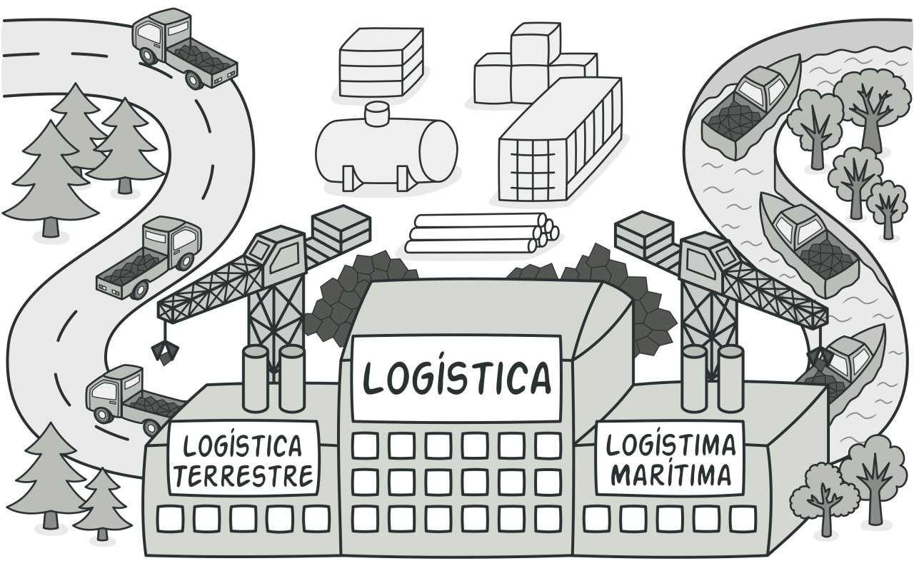
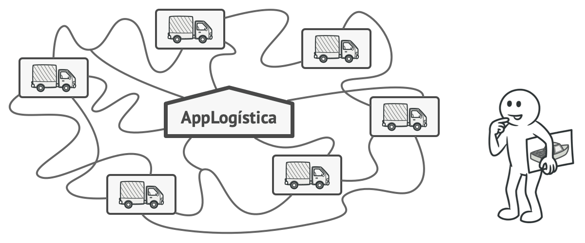
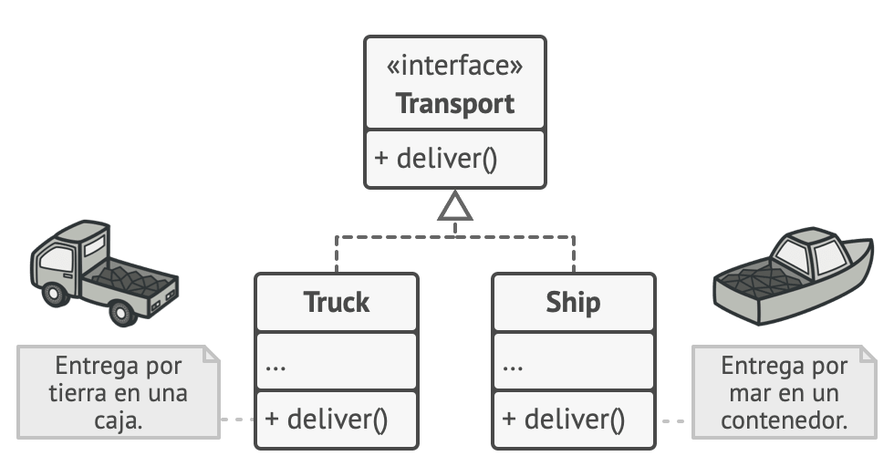
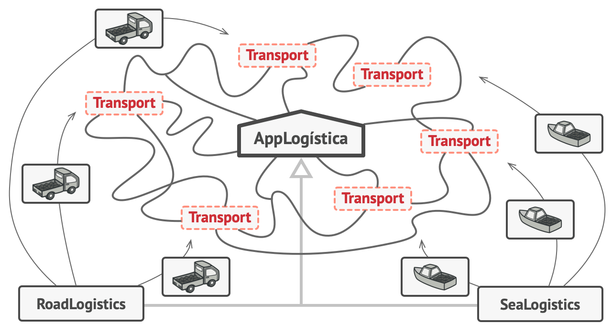

# Factory Method (Método fábrica o Constructor Virtual)

## Propósito

Factory Method es un patrón de diseño creacional que proporciona una interfaz para crear objetos en una superclase, mientras permite a las subclases alterar el tipo de objetos que se crearán.

## Problema

Imagina que estás creando una aplicación de gestión logística. La primera versión de tu aplicación sólo es capaz de manejar el transporte en camión, por lo que la mayor parte de tu código se encuentra dentro de la clase `Camión`.

Al cabo de un tiempo, tu aplicación se vuelve bastante popular. Cada día recibes decenas de peticiones de empresas de transporte marítimo para que incorpores la logística por mar a la aplicación.

Añadir una nueva clase al programa no es tan sencillo si el resto del código ya está acoplado a clases existentes.

Estupendo, ¿verdad? Pero, ¿qué pasa con el código? En este momento, la mayor parte de tu código está acoplado a la clase `Camión`. Para añadir barcos a la aplicación habría que hacer cambios en toda la base del código. Además, si más tarde decides añadir otro tipo de transporte a la aplicación, probablemente tendrás que volver a hacer todos estos cambios.

Al final acabarás con un código bastante sucio, plagado de condicionales que cambian el comportamiento de la aplicación dependiendo de la clase de los objetos de transporte.

## Solución

El patrón Factory Method sugiere que, en lugar de llamar al operador `new` para construir objetos directamente, se invoque a un método fábrica especial. No te preocupes: los objetos se siguen creando a través del operador `new`, pero se invocan desde el método fábrica. Los objetos devueltos por el método fábrica a menudo se denominan productos.

Las subclases pueden alterar la clase de los objetos devueltos por el método fábrica.

A simple vista, puede parecer que este cambio no tiene sentido, ya que tan solo hemos cambiado el lugar desde donde invocamos al constructor. Sin embargo, piensa en esto: ahora puedes sobrescribir el método fábrica en una subclase y cambiar la clase de los productos creados por el método.

No obstante, hay una pequeña limitación: las subclases sólo pueden devolver productos de distintos tipos si dichos productos tienen una clase base o interfaz común. Además, el método fábrica en la clase base debe tener su tipo de retorno declarado como dicha interfaz.

Todos los productos deben seguir la misma interfaz.

Por ejemplo, tanto la clase `Camión` como la clase `Barco` deben implementar la interfaz `Transporte`, que declara un método llamado `entrega`. Cada clase implementa este método de forma diferente: los camiones entregan su carga por tierra, mientras que los barcos lo hacen por mar. El método fábrica dentro de la clase `LogísticaTerrestre` devuelve objetos de tipo camión, mientras que el método fábrica de la clase `LogísticaMarítima` devuelve barcos.

Siempre y cuando todas las clases de producto implementen una interfaz común, podrás pasar sus objetos al código cliente sin descomponerlo.

El código que utiliza el método fábrica (a menudo denominado código cliente) no encuentra diferencias entre los productos devueltos por varias subclases, y trata a todos los productos como la clase abstracta `Transporte`. El cliente sabe que todos los objetos de transporte deben tener el método `entrega`, pero no necesita saber cómo funciona exactamente.

## Estructura

1. El `Producto` declara la interfaz, que es común a todos los objetos que puede producir la clase creadora y sus subclases.
2. Los `Productos Concretos` son distintas implementaciones de la interfaz de producto.
3. La clase `Creadora` declara el método fábrica que devuelve nuevos objetos de producto. Es importante que el tipo de retorno de este método coincida con la interfaz de producto.

Puedes declarar el patrón Factory Method como abstracto para forzar a todas las subclases a implementar sus propias versiones del método. Como alternativa, el método fábrica base puede devolver algún tipo de producto por defecto.

Observa que, a pesar de su nombre, la creación de producto no es la principal responsabilidad de la clase creadora. Normalmente, esta clase cuenta con alguna lógica de negocios central relacionada con los productos. El patrón Factory Method ayuda a desacoplar esta lógica de las clases concretas de producto. Aquí tienes una analogía: una gran empresa de desarrollo de software puede contar con un departamento de formación de programadores. Sin embargo, la principal función de la empresa sigue siendo escribir código, no preparar programadores.
4. Los `Creadores Concretos` sobrescriben el Factory Method base, de modo que devuelva un tipo diferente de producto.

Observa que el método fábrica no tiene que crear nuevas instancias todo el tiempo. También puede devolver objetos existentes de una memoria caché, una agrupación de objetos, u otra fuente.

## Aplicabilidad

* **Utiliza el Método Fábrica cuando no conozcas de antemano las dependencias y los tipos exactos de los objetos con los que deba funcionar tu código.**

  El patrón Factory Method separa el código de construcción de producto del código que hace uso del producto. Por ello, es más fácil extender el código de construcción de producto de forma independiente al resto del código.

  Por ejemplo, para añadir un nuevo tipo de producto a la aplicación, sólo tendrás que crear una nueva subclase creadora y sobrescribir el Factory Method que contiene.

* **Utiliza el Factory Method cuando quieras ofrecer a los usuarios de tu biblioteca o framework, una forma de extender sus componentes internos.**

  La herencia es probablemente la forma más sencilla de extender el comportamiento por defecto de una biblioteca o un framework. Pero, ¿cómo reconoce el framework si debe utilizar tu subclase en lugar de un componente estándar?

  La solución es reducir el código que construye componentes en todo el framework a un único patrón Factory Method y permitir que cualquiera sobrescriba este método además de extender el propio componente.

  Veamos cómo funcionaría. Imagina que escribes una aplicación utilizando un framework de UI de código abierto. Tu aplicación debe tener botones redondos, pero el framework sólo proporciona botones cuadrados. Extiendes la clase estándar `Botón` con una maravillosa subclase `BotónRedondo`, pero ahora tienes que decirle a la clase principal `FrameworkUI` que utilice la nueva subclase de botón en lugar de la clase por defecto.

  Para conseguirlo, creamos una subclase `UIConBotonesRedondos` a partir de una clase base del framework y sobrescribimos su método `crearBotón`. Si bien este método devuelve objetos `Botón` en la clase base, haces que tu subclase devuelva objetos `BotónRedondo`. Ahora, utiliza la clase `UIConBotonesRedondos` en lugar de `FrameworkUI`. ¡Eso es todo!

* **Utiliza el Factory Method cuando quieras ahorrar recursos del sistema mediante la reutilización de objetos existentes en lugar de reconstruirlos cada vez.**

  A menudo experimentas esta necesidad cuando trabajas con objetos grandes y que consumen muchos recursos, como conexiones de bases de datos, sistemas de archivos y recursos de red.

  Pensemos en lo que hay que hacer para reutilizar un objeto existente:

  1. Primero, debemos crear un almacenamiento para llevar un registro de todos los objetos creados.
  2. Cuando alguien necesite un objeto, el programa deberá buscar un objeto disponible dentro de ese agrupamiento.
  3. … y devolverlo al código cliente.
  4. Si no hay objetos disponibles, el programa deberá crear uno nuevo (y añadirlo al agrupamiento).

¡Eso es mucho código! Y hay que ponerlo todo en un mismo sitio para no contaminar el programa con código duplicado.

Es probable que el lugar más evidente y cómodo para colocar este código sea el constructor de la clase cuyos objetos intentamos reutilizar. Sin embargo, un constructor siempre debe devolver **nuevos objetos** por definición. No puede devolver instancias existentes.

Por lo tanto, necesitas un método regular capaz de crear nuevos objetos, además de reutilizar los existentes. Eso suena bastante a lo que hace un patrón Factory Method.

## Cómo implementarlo

1. Haz que todos los productos sigan la misma interfaz. Esta interfaz deberá declarar métodos que tengan sentido en todos los productos.

2. Añade un patrón Factory Method vacío dentro de la clase creadora. El tipo de retorno del método deberá coincidir con la interfaz común de los productos.

3. Encuentra todas las referencias a constructores de producto en el código de la clase creadora. Una a una, sustitúyelas por invocaciones al Factory Method, mientras extraes el código de creación de productos para colocarlo dentro del Factory Method.

  Puede ser que tengas que añadir un parámetro temporal al Factory Method para controlar el tipo de producto devuelto.

  A estas alturas, es posible que el aspecto del código del Factory Method luzca bastante desagradable. Puede ser que tenga un operador `switch` largo que elige qué clase de producto instanciar. Pero, no te preocupes, lo arreglaremos enseguida.

4. Ahora, crea un grupo de subclases creadoras para cada tipo de producto enumerado en el Factory Method. Sobrescribe el Factory Method en las subclases y extrae las partes adecuadas de código constructor del método base.

5. Si hay demasiados tipos de producto y no tiene sentido crear subclases para todos ellos, puedes reutilizar el parámetro de control de la clase base en las subclases.

  Por ejemplo, imagina que tienes la siguiente jerarquía de clases: la clase base `Correo` con las subclases `CorreoAéreo` y `CorreoTerrestre` y la clase `Transporte` con `Avión`, `Camión` y `Tren`. La clase `CorreoAéreo` sólo utiliza objetos `Avión`, pero `CorreoTerrestre` puede funcionar tanto con objetos `Camión`, como con objetos `Tren`. Puedes crear una nueva subclase (digamos, `CorreoFerroviario`) que gestione ambos casos, pero hay otra opción. El código cliente puede pasar un argumento al Factory Method de la clase `CorreoTerrestre` para controlar el producto que quiere recibir.

6. Si, tras todas las extracciones, el Factory Method base queda vacío, puedes hacerlo abstracto. Si queda algo dentro, puedes convertirlo en un comportamiento por defecto del método.

## Pros y contras

:heavy_check_mark:  Evitas un acoplamiento fuerte entre el creador y los productos concretos.

:heavy_check_mark: Principio de responsabilidad única. Puedes mover el código de creación de producto a un lugar del programa, haciendo que el código sea más fácil de mantener.

:heavy_check_mark: Principio de abierto/cerrado. Puedes incorporar nuevos tipos de productos en el programa sin descomponer el código cliente existente.

:x: Puede ser que el código se complique, ya que debes incorporar una multitud de nuevas subclases para implementar el patrón. La situación ideal sería introducir el patrón en una jerarquía existente de clases creadoras.
