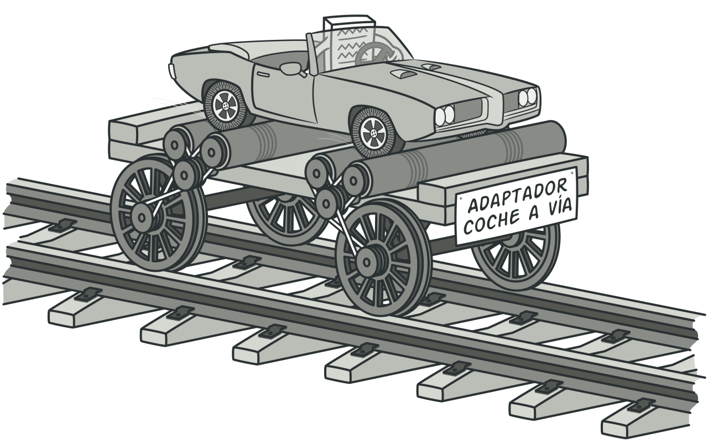
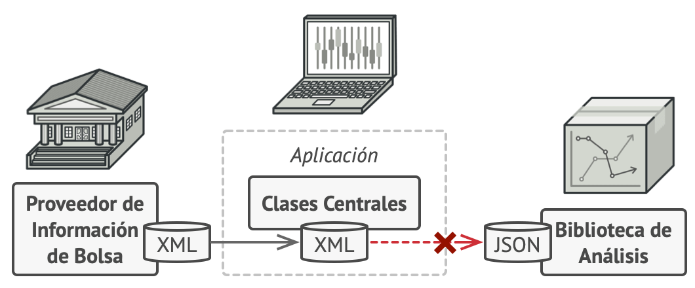

# Adapter (Adaptador, Envoltorio, Wrapper)

## Propósito

Adapter es un patrón de diseño estructural que permite la colaboración entre objetos con interfaces incompatibles.

## Problema

Imagina que estás creando una aplicación de monitoreo del mercado de valores. La aplicación descarga la información de bolsa desde varias fuentes en formato XML para presentarla al usuario con bonitos gráficos y diagramas.

En cierto momento, decides mejorar la aplicación integrando una inteligente biblioteca de análisis de una tercera persona. Pero hay una trampa: la biblioteca de análisis solo funciona con datos en formato JSON.

La estructura de la aplicación antes de la integración con la biblioteca de análisis
No puedes utilizar la biblioteca de análisis “tal cual” porque ésta espera los datos en un formato que es incompatible con tu aplicación.

Podrías cambiar la biblioteca para que funcione con XML. Sin embargo, esto podría descomponer parte del código existente que depende de la biblioteca. Y, lo que es peor, podrías no tener siquiera acceso al código fuente de la biblioteca, lo que hace imposible esta solución.

## Solución

Puedes crear un adaptador. Se trata de un objeto especial que convierte la interfaz de un objeto, de forma que otro objeto pueda comprenderla.

Un adaptador envuelve uno de los objetos para esconder la complejidad de la conversión que tiene lugar tras bambalinas. El objeto envuelto ni siquiera es consciente de la existencia del adaptador. Por ejemplo, puedes envolver un objeto que opera con metros y kilómetros con un adaptador que convierte todos los datos al sistema anglosajón, es decir, pies y millas.

Los adaptadores no solo convierten datos a varios formatos, sino que también ayudan a objetos con distintas interfaces a colaborar. Funciona así:

1. El adaptador obtiene una interfaz compatible con uno de los objetos existentes.
2. Utilizando esta interfaz, el objeto existente puede invocar con seguridad los métodos del adaptador.
3. Al recibir una llamada, el adaptador pasa la solicitud al segundo objeto, pero en un formato y orden que ese segundo objeto espera.

En ocasiones se puede incluso crear un adaptador de dos direcciones que pueda convertir las llamadas en ambos sentidos.

Regresemos a nuestra aplicación del mercado de valores. Para resolver el dilema de los formatos incompatibles, puedes crear adaptadores de XML a JSON para cada clase de la biblioteca de análisis con la que trabaje tu código directamente. Después ajustas tu código para que se comunique con la biblioteca únicamente a través de estos adaptadores. Cuando un adaptador recibe una llamada, traduce los datos XML entrantes a una estructura JSON y pasa la llamada a los métodos adecuados de un objeto de análisis envuelto.

## Analogía en el mundo real

*Una maleta antes y después de un viaje al extranjero.*

Cuando viajas de Europa a Estados Unidos por primera vez, puede ser que te lleves una sorpresa cuanto intentes cargar tu computadora portátil. Los tipos de enchufe son diferentes en cada país, por lo que un enchufe español no sirve en Estados Unidos. El problema puede solucionarse utilizando un adaptador que incluya el enchufe americano y el europeo.

## Estructura

**Adaptador de objetos**

Esta implementación utiliza el principio de composición de objetos: el adaptador implementa la interfaz de un objeto y envuelve el otro. Puede implementarse en todos los lenguajes de programación populares.

1. La clase **Cliente** contiene la lógica de negocio existente del programa.
2. La **Interfaz con el Cliente** describe un protocolo que otras clases deben seguir para poder colaborar con el código cliente.
3. **Servicio** es alguna clase útil (normalmente de una tercera parte o heredada). El cliente no puede utilizar directamente esta clase porque tiene una interfaz incompatible.
4. La clase **Adaptadora** es capaz de trabajar tanto con la clase cliente como con la clase de servicio: implementa la interfaz con el cliente, mientras envuelve el objeto de la clase de servicio. La clase adaptadora recibe llamadas del cliente a través de la interfaz adaptadora y las traduce en llamadas al objeto envuelto de la clase de servicio, pero en un formato que pueda comprender.
5. El código cliente no se acopla a la clase adaptadora concreta siempre y cuando funcione con la clase adaptadora a través de la interfaz con el cliente. Gracias a esto, puedes introducir nuevos tipos de adaptadores en el programa sin descomponer el código cliente existente. Esto puede resultar útil cuando la interfaz de la clase de servicio se cambia o sustituye, ya que puedes crear una nueva clase adaptadora sin cambiar el código cliente.

**Clase adaptadora**

Esta implementación utiliza la herencia, porque la clase adaptadora hereda interfaces de ambos objetos al mismo tiempo. Ten en cuenta que esta opción sólo puede implementarse en lenguajes de programación que soporten la herencia múltiple, como C++.

1. La **Clase adaptadora** no necesita envolver objetos porque hereda comportamientos tanto de la clase cliente como de la clase de servicio. La adaptación tiene lugar dentro de los métodos sobrescritos. La clase adaptadora resultante puede utilizarse en lugar de una clase cliente existente.

## Aplicabilidad

* **Utiliza la clase adaptadora cuando quieras usar una clase existente, pero cuya interfaz no sea compatible con el resto del código.**

  El patrón Adapter te permite crear una clase intermedia que sirva como traductora entre tu código y una clase heredada, una clase de un tercero o cualquier otra clase con una interfaz extraña.

* **Utiliza el patrón cuando quieras reutilizar varias subclases existentes que carezcan de alguna funcionalidad común que no pueda añadirse a la superclase.**

  Puedes extender cada subclase y colocar la funcionalidad que falta, dentro de las nuevas clases hijas. No obstante, deberás duplicar el código en todas estas nuevas clases, lo cual huele muy mal.

  Una solución mucho más elegante sería colocar la funcionalidad que falta dentro de una clase adaptadora. Después puedes envolver objetos a los que les falten funciones, dentro de la clase adaptadora, obteniendo esas funciones necesarias de un modo dinámico. Para que esto funcione, las clases en cuestión deben tener una interfaz común y el campo de la clase adaptadora debe seguir dicha interfaz. Este procedimiento es muy similar al del patrón Decorator.

## Cómo implementarlo

1. Asegúrate de que tienes al menos dos clases con interfaces incompatibles:
  * Una útil clase servicio que no puedes cambiar (a menudo de un tercero, heredada o con muchas dependencias existentes).
  * Una o varias clases cliente que se beneficiarían de contar con una clase de servicio.
2. Declara la interfaz con el cliente y describe el modo en que las clases cliente se comunican con la clase de servicio.
3. Crea la clase adaptadora y haz que siga la interfaz con el cliente. Deja todos los métodos vacíos por ahora.
4. Añade un campo a la clase adaptadora para almacenar una referencia al objeto de servicio. La práctica común es inicializar este campo a través del constructor, pero en ocasiones es adecuado pasarlo al adaptador cuando se invocan sus métodos.
5. Uno por uno, implementa todos los métodos de la interfaz con el cliente en la clase adaptadora. La clase adaptadora deberá delegar la mayor parte del trabajo real al objeto de servicio, gestionando tan solo la interfaz o la conversión de formato de los datos.
6. Las clases cliente deberán utilizar la clase adaptadora a través de la interfaz con el cliente. Esto te permitirá cambiar o extender las clases adaptadoras sin afectar al código cliente.

## Pros y contras

:heavy_check_mark: Principio de responsabilidad única. Puedes separar la interfaz o el código de conversión de datos de la lógica de negocio primaria del programa.

:heavy_check_mark: Principio de abierto/cerrado. Puedes introducir nuevos tipos de adaptadores al programa sin descomponer el código cliente existente, siempre y cuando trabajen con los adaptadores a través de la interfaz con el cliente.

:x: La complejidad general del código aumenta, ya que debes introducir un grupo de nuevas interfaces y clases. En ocasiones resulta más sencillo cambiar la clase de servicio de modo que coincida con el resto de tu código.
